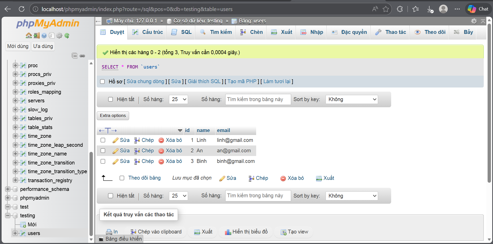
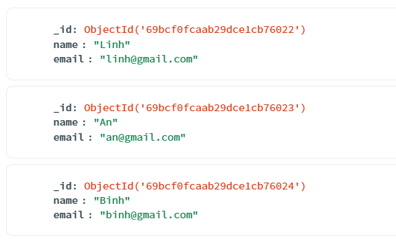

# 1. Tạo bảng users trong MySQL và thêm 3 bản ghi 

Sử dụng lệnh trên MySQL

``` bash  
CREATE TABLE users (
    id INT AUTO_INCREMENT PRIMARY KEY,
    name VARCHAR(100),
    email VARCHAR(100)
);

    INSERT INTO users (name, email) VALUES
    ('Linh', 'linh@gmail.com'),
    ('An', 'an@gmail.com'),
    ('Binh', 'binh@gmail.com');

````

# 2. Tạo collection users trong MongDB Atlas và thêm 3 bản ghi
Trên MongDB giao diện, sử dụng Add Data

```bash
[
  {
    "name": "Linh",
    "email": "linh@gmail.com"
  },
  {
    "name": "An",
    "email": "an@gmail.com"
  },
  {
    "name": "Binh",
    "email": "binh@gmail.com"
  }
]
```

# 4. Chụp ảnh màn hình 
## Bảng


## Document


# 5. So sánh MySQL và MongoDB

**Giống nhau**

&nbsp;&nbsp;&nbsp;&nbsp;&nbsp;&nbsp;&nbsp;&nbsp; Đều dùng để lưu trữ và quản lý dữ liệu

&nbsp;&nbsp;&nbsp;&nbsp;&nbsp;&nbsp;&nbsp;&nbsp; Hỗ trợ các thao tác Thêm, Sửa, Đọc, Xoá

**Khác nhau**


| Đặc điểm     | MySQL (Relational)                                      | MongoDB (Document-oriented)                                  |
|--------------|----------------------------------------------------------|--------------------------------------------------------------|
| Cấu trúc     | Dữ liệu dạng Bảng  (Table) với các hàng và cột cố định.   | Dữ liệu dạng Document (BSON/JSON), thay đổi linh hoạt.                 |
| Ràng buộc    | Phải định nghĩa kiểu dữ liệu, khoá  cho từng bảng, yêu cầu nghiêm ngặt trước khi chèn. | Không yêu cầu Schema cố định, mỗi record có thể có các trường khác nhau. |
| Định danh    | Thường dùng id kiểu số nguyên tăng tự động.                  | Dùng _id kiểu ObjectId (chuỗi băm 24 ký tự).                |

**Nếu cần linh hoạt trong việc thay đổi cấu trúc dữ liệu, bạn chọn MySQL hay MongDB? Vì sao?**

&nbsp;&nbsp;&nbsp;&nbsp;&nbsp;&nbsp;&nbsp;&nbsp;Nếu cần sự linh hoạt trong việc thay đổi cấu trúc dữ liệu, sẽ chọn MongoDB. 

&nbsp;&nbsp;&nbsp;&nbsp;&nbsp;&nbsp;&nbsp;&nbsp;Bởi vì trong MySQL, nếu muốn thêm một trường mới (ví dụ: số điện thoại vào bảng chỉ có id, name, email), cần phải dùng lệnh ALTER TABLE, việc này có thể gây treo hệ thống nếu bảng có hàng triệu record. Trong khi với MongoDB, chỉ cần chèn dữ liệu mới vào mà không cần khai báo trước, giúp quá trình phát triển diễn ra cực kỳ nhanh chóng.


**Hãy nêu một ví dụ ứng dụng thực tế phù hợp với MongoDB hơn MySQL**


&nbsp;&nbsp;&nbsp;&nbsp;&nbsp;&nbsp;&nbsp;&nbsp;Ứng dụng thực tế: Quản lý Sản phẩm Thương mại điện tử.

&nbsp;&nbsp;&nbsp;&nbsp;&nbsp;&nbsp;&nbsp;&nbsp;Bởi vì mỗi loại mặt hàng có các thuộc tính hoàn toàn khác nhau. Ví dụ: Laptop thì cần thông số CPU, RAM, Card đồ họa; nhưng mặt hàng Quần áo thì lại cần Kích cỡ, Chất liệu, Màu sắc. 

&nbsp;&nbsp;&nbsp;&nbsp;&nbsp;&nbsp;&nbsp;&nbsp;Nếu dùng MySQL, sẽ phải tạo rất nhiều bảng phụ hoặc để nhiều cột có giá trị ``NULL``. MongoDB cho phép lưu mỗi sản phẩm là một Document với các trường riêng, giúp truy xuất nhanh và quản lý dễ dàng hơn nhiều.